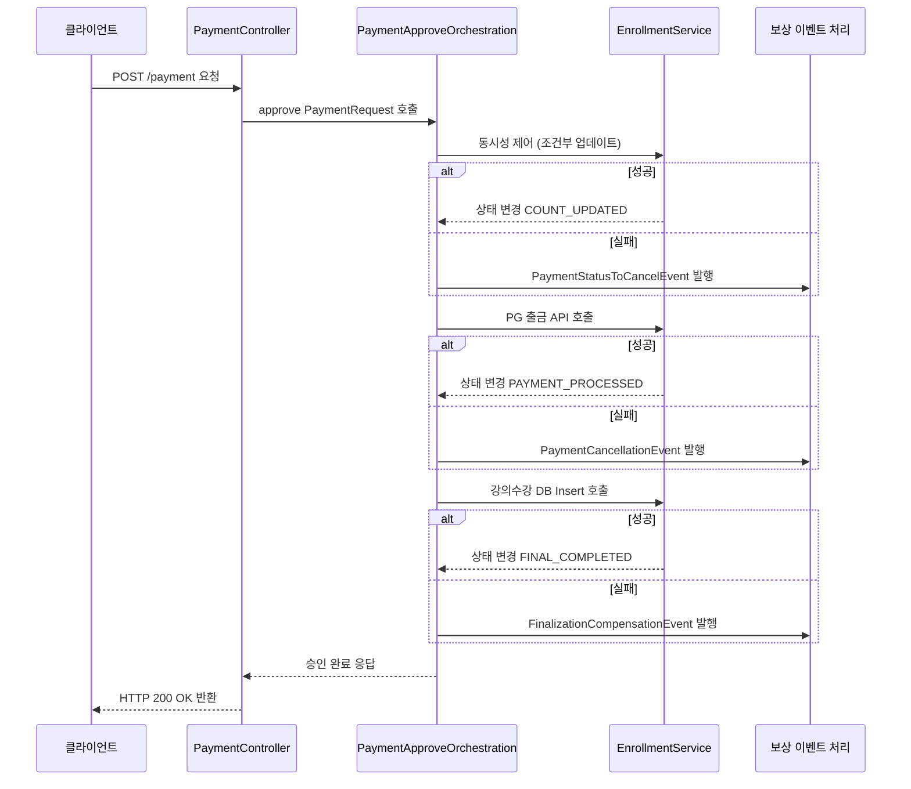
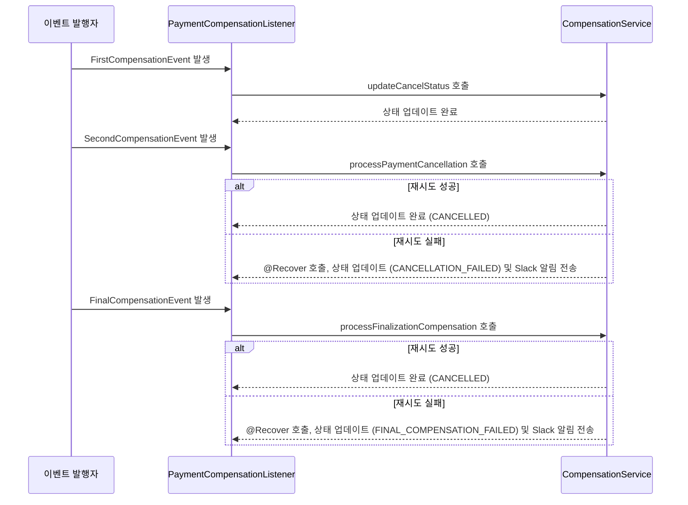

# Payment System.

- 이 프로젝트는 "허슬풋볼" 이후 회고를 통해 결제 프로세스를 개선한 예제 형식의 프로젝트 입니다.
- 트랜잭션 분리를 통해 락 소유시간을 줄여 동시성을 최대화 하였습니다.
- 또한 결제 승인, 보상(Compensation) 처리, 그리고 보정(Adjustment) 과정을 통해 결제 일관성과 신뢰성을 보장합니다.

## 프로젝트 주요 구조

```
├── application
│   ├── event
│   │   ├── PaymentCompensationListener.java           // 보상 이벤트를 수신하여 CompensationService 호출
│   │   ├── FirstCompensationEvent.java                // 동시성 제어 실패 등 초기 단계 실패 보상 이벤트
│   │   ├── SecondCompensationEvent.java               // PG 결제 실패 시 보상 이벤트
│   │   └── FinalCompensationEvent.java                // 최종 결제 DB 반영 실패 시 보상 이벤트
│   ├── exception
│   │   ├── BusinessException.java                     // 비즈니스 로직 관련 예외 처리
│   │   └── GlobalExceptionHandler.java                // 전역 예외 핸들러
│   ├── orchestration
│   │   ├── PaymentApproveOrchestration.java           // 결제 승인 오케스트레이션 인터페이스
│   │   └── impl
│   │       ├── PaymentApprove1Phase.java              // 1단계 결제 승인 로직 (성능 비교를 위한 예제 사용X)
│   │       └── PaymentApprove3Phase.java              // 3단계 결제 승인 오케스트레이션 구현 (실제 사용)
│   └── service
│       ├── CompensationService.java                   // 보상 로직 구현: 실패 시 롤백 및 상태 업데이트
│       ├── EnrollmentService.java                     // 수강 인원 증가, PG 결제 호출, 최종 Enrollment 반영
│       └── PaymentAdjustmentService.java              // 결제 조정(보정) 관련 기능 (추가 기능)
```

## 주요 기능 및 동작 방식

### 1. 결제 승인 프로세스 (3단계 오케스트레이션)

- **단계 1: 동시성 제어 및 수강 인원 증가**  
  `EnrollmentService.enrollmentCountTryIncrement` 메소드에서 강의의 수강 인원을 증가시키고, 결제 상태를 `CREATED`에서 `COUNT_UPDATED`로 조건부 업데이트합니다.
  조건부 업데이트를 이용해 한번의 Query로 동시성을 제어합니다. 
  - 실패 시: 수강 인원 초과 등의 문제로 `PaymentStatusToCancelEvent` 이벤트를 발행하여 보상 로직을 수행합니다.

- **단계 2: PG API 결제 호출**  
  `EnrollmentService.processPayment` 메소드에서 외부 PG API(모킹)를 호출하여 결제를 처리합니다. 결제 성공 시 Payment 상태가 `COUNT_UPDATED`에서 `PAYMENT_PROCESSED`로 변경됩니다.  
  - 실패 시: `PaymentCancellationEvent` 이벤트를 발행하여 보상 처리를 수행합니다.

- **단계 3: 최종 Enrollment 반영**  
  `EnrollmentService.finalizeEnrollment` 메소드에서 실제 수강 신청(Enrollment) 기록을 DB에 저장하고, Payment 상태를 `PAYMENT_PROCESSED`에서 `FINAL_COMPLETED`로 업데이트합니다.  
  - 실패 시: `FinalizationCompensationEvent` 이벤트를 발행하여 보상 처리를 진행합니다.

### 2. 보상(Compensation) 처리

- **보상 이벤트 리스너**  
  `PaymentCompensationListener` 클래스는 비동기 이벤트 리스닝을 통해 각 보상 이벤트(`PaymentStatusToCancelEvent`, `PaymentCancellationEvent`, `FinalizationCompensationEvent`)를 수신하고, `CompensationService`의 해당 보상 메소드를 호출합니다.



- **보상 로직**  
  `CompensationService`는 다음과 같은 보상 처리를 수행합니다:
  - ** 동시성 제어 실패 보상 : FirstCompensationEvent**  
    - Payment 상태를 `CREATED`에서 `EXCEEDS_CAPACITY`로 업데이트합니다.
  - **PG 결제 실패 보상 : SecondCompensationEvent**  
    - EnrollmentCount를 감소시키고, Payment 상태를 `COUNT_UPDATED`에서 `CANCELLED`로 업데이트합니다.
  - **Enrollment 저장 실패 보상 : FinalCompensationEvent **  
    - EnrollmentCount 감소, 외부 PG API 모킹을 통한 취소 호출, 그리고 Payment 상태를 `PAYMENT_PROCESSED`에서 `CANCELLED`로 업데이트합니다.
  - **재시도 및 Fallback:**  
    - Spring Retry를 이용하여 최대 3회 재시도하며, 재시도 실패 시 `@Recover` 메소드를 통해 상태를 `CANCELLATION_FAILED` 또는 `FINAL_COMPENSATION_FAILED`로 업데이트하고, Slack 알림(모킹)을 전송합니다.

### 3. 예외 및 트랜잭션 관리

- **예외 처리:**  
  `BusinessException`과 `GlobalExceptionHandler`를 통해 비즈니스 로직의 예외를 처리하며, 문제 발생 시 적절한 보상 이벤트를 트리거합니다.

- **조정 과정: 트랜잭션 3단계 실행 중 장애 대비:**
  현재 시각으로부터 5분 이전에 생성된 결제 중 EXCEEDS_CAPACITY 또는 FINAL_COMPLETED가 아닌 결제들에 대해 PG API(모킹)를 호출하여 실제 결제 내역을 비교하고 해결합니다.
  프로젝트 실행시 조정 과정을 바로 실행하여 서버 복구 후에 일관성을 점검합니다.

## 향후 개선 사항

- 실제 PG API 연동 구현 및 외부 결제 시스템 연동
- 사용자 인증 및 권한 관리 기능 추가
- 상세한 예외 처리 및 로깅 강화
- 보상 처리 로직 확장 및 다양한 실패 시나리오 지원
